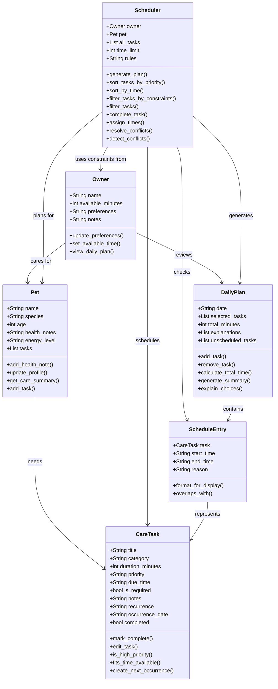
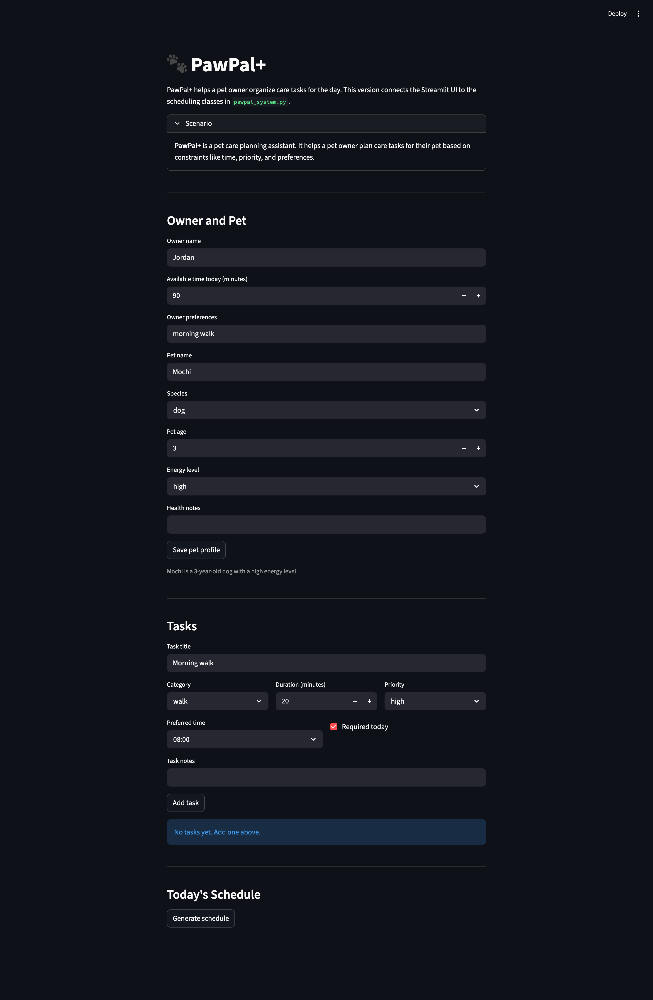

# PawPal+ (Module 2 Project)

You are building **PawPal+**, a Streamlit app that helps a pet owner plan care tasks for their pet.

## Scenario

A busy pet owner needs help staying consistent with pet care. They want an assistant that can:

- Track pet care tasks (walks, feeding, meds, enrichment, grooming, etc.)
- Consider constraints (time available, priority, owner preferences)
- Produce a daily plan and explain why it chose that plan

Your job is to design the system first (UML), then implement the logic in Python, then connect it to the Streamlit UI.

## What you will build

Your final app should:

- Let a user enter basic owner + pet info
- Let a user add/edit tasks (duration + priority at minimum)
- Generate a daily schedule/plan based on constraints and priorities
- Display the plan clearly (and ideally explain the reasoning)
- Include tests for the most important scheduling behaviors

## System Design

### Core User Actions

- Enter and manage basic owner and pet information so the app can personalize the plan around the pet's needs and the owner's preferences.
- Create and manage pet care tasks such as walks, feeding, medication, grooming, and enrichment, including details like duration and priority.
- Generate and review a daily care plan that organizes those tasks into a realistic schedule and explains why certain tasks were selected or ordered the way they were.

### Mermaid Class Diagram



## Current Implementation

- `pawpal_system.py` contains the core domain model: `Owner`, `Pet`, `CareTask`, `ScheduleEntry`, `DailyPlan`, and `Scheduler`.
- The backend currently supports updating owner and pet profiles, adding pet tasks, marking tasks complete, editing task details, and generating a daily plan.
- The scheduler orders tasks by required status, priority, and due time, fits tasks within the owner's available minutes, assigns simple time slots, and records unscheduled tasks.
- `main.py` provides a terminal demo that creates one owner, two pets, several timed tasks, and prints today's schedule.
- `tests/test_pawpal.py` includes simple tests for task completion and adding a task to a pet.

## Smarter Scheduling

- Tasks can be sorted by time and filtered by completion status or pet name.
- Daily and weekly recurring tasks automatically create the next occurrence when completed.
- The scheduler can detect overlapping tasks and return warning messages instead of crashing.
- The terminal demo now shows sorted tasks, filtered task views, and conflict warnings.

## Features

- Sorting by time so tasks can be viewed in chronological order.
- Priority-based scheduling that favors required and higher-priority tasks.
- Time-limit filtering so the schedule only includes tasks that fit in the owner's available minutes.
- Conflict warnings for overlapping task times instead of application crashes.
- Daily and weekly recurrence that automatically creates the next task instance when completed.
- Filtering by completion status or pet name for easier task review.
- Schedule explanations that describe why each task was selected.

## 📸 Demo



## Testing PawPal+

Run the test suite with:

```bash
python -m pytest
```

The current tests cover task completion, adding tasks to a pet, chronological sorting, daily recurrence, and conflict detection for both same-pet and cross-pet overlaps.

Confidence Level: `★★★★☆` (4/5) based on the current passing test suite and manual terminal checks. The core scheduling behavior is working, but more edge-case coverage would improve confidence further.

## Getting started

### Setup

```bash
python -m venv .venv
source .venv/bin/activate  # Windows: .venv\Scripts\activate
pip install -r requirements.txt
```

### Suggested workflow

1. Read the scenario carefully and identify requirements and edge cases.
2. Draft a UML diagram (classes, attributes, methods, relationships).
3. Convert UML into Python class stubs (no logic yet).
4. Implement scheduling logic in small increments.
5. Add tests to verify key behaviors.
6. Connect your logic to the Streamlit UI in `app.py`.
7. Refine UML so it matches what you actually built.
